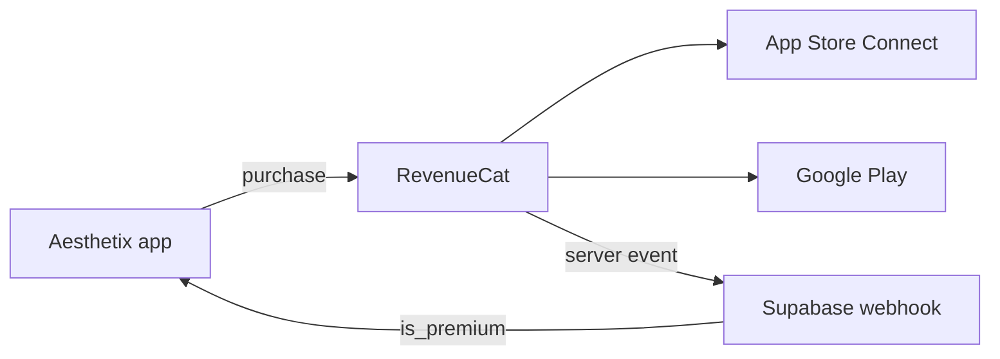

# Aesthetix AI — Subscriptions setup (ASC · Play · RevenueCat)

Copy the identifiers from `src/subscription/storeCatalog.ts`. **Use the same strings everywhere** — a typo breaks purchases and webhooks.

## Overview



| Concept | Value |
|--------|--------|
| **Entitlement** (access gate) | `premium` |
| **Offering** | `default` |
| **RC package IDs** | `weekly`, `monthly`, `yearly` |
| **Store product IDs** | `aesthetix_weekly`, `aesthetix_monthly`, `aesthetix_yearly` |
| **Apple subscription group** | `aesthetix_premium` |
| **App bundle / package** | `com.physiquemax.ai` |

---

## 1. App Store Connect (iOS)

1. **My Apps** → Aesthetix AI → **Subscriptions** → **+ Subscription Group**.
2. **Reference name:** `aesthetix_premium` (=`APP_STORE_SUBSCRIPTION_GROUP_ID`).
3. Add three **auto-renewable subscriptions**:

| Reference name | Product ID (critical) | Duration | Price (USD) | Free trial |
|----------------|----------------------|----------|-------------|------------|
| Aesthetix Weekly | `aesthetix_weekly` | 1 week | $4.99 | 3 days |
| Aesthetix Monthly | `aesthetix_monthly` | 1 month | $12.99 | 3 days |
| Aesthetix Yearly | `aesthetix_yearly` | 1 year | $79.99 | 3 days |

4. Localizations: display name + description (e.g. “Aesthetix Premium — unlimited scans”).
5. Submit subscriptions for review with the app version.

**Product ID must be exactly** `aesthetix_weekly` / `aesthetix_monthly` / `aesthetix_yearly` (lowercase, underscore).

---

## 2. Google Play Console (Android)

1. **Monetize** → **Products** → **Subscriptions** → **Create subscription**.
2. Create three subscriptions with **Product ID** matching iOS:

| Product ID | Billing period | Price | Free trial |
|------------|----------------|-------|------------|
| `aesthetix_weekly` | Weekly | $4.99 | 3 days |
| `aesthetix_monthly` | Monthly | $12.99 | 3 days |
| `aesthetix_yearly` | Yearly | $79.99 | 3 days |

3. Base plan + offer: enable **free trial** 3 days on each (matches in-app copy).
4. Activate subscriptions.

---

## 3. RevenueCat

### Project & apps

1. [app.revenuecat.com](https://app.revenuecat.com) → project **Aesthetix AI**.
2. Add **iOS app** (bundle `com.physiquemax.ai`) and **Android app** (package `com.physiquemax.ai`).
3. Connect App Store Connect API key + Google Play service account.

### Entitlement

| Identifier | Display name |
|------------|--------------|
| `premium` | Aesthetix Premium |

Attach **all three** store products to this entitlement.

### Products

Create products with **Store product identifier** = exact ASC/Play IDs:

- `aesthetix_weekly`
- `aesthetix_monthly`
- `aesthetix_yearly`

### Offering `default`

| Package identifier | Product | Entitlement |
|--------------------|---------|-------------|
| `weekly` | `aesthetix_weekly` | `premium` |
| `monthly` | `aesthetix_monthly` | `premium` |
| `yearly` | `aesthetix_yearly` | `premium` |

Set **default** offering as current.

### Webhook (already on Supabase)

- URL: `https://krasjpoxoilwtmovjuho.supabase.co/functions/v1/revenuecat`
- Authorization: value from `supabase/.secrets.local` → `REVENUECAT_WEBHOOK_AUTH`

### App user ID

In the app (when IAP is enabled): `Purchases.logIn(supabaseUserId)` so `app_user_id` = UUID from `auth.users`.

---

## 4. App code mapping

| UI plan (`SubscriptionPlanId`) | RC package | Store product ID |
|----------------------------------|------------|------------------|
| `weekly` | `weekly` | `aesthetix_weekly` |
| `monthly` | `monthly` | `aesthetix_monthly` |
| `yearly` | `yearly` | `aesthetix_yearly` |

Defined in: `src/subscription/storeCatalog.ts`

---

## 5. Enable IAP in the app (when stores are live)

```bash
npx expo install react-native-purchases
```

```env
EXPO_PUBLIC_IAP_ENABLED=true
EXPO_PUBLIC_REVENUECAT_IOS_API_KEY=appl_...
EXPO_PUBLIC_REVENUECAT_ANDROID_API_KEY=goog_...
```

Complete `src/subscription/purchases.ts` (SDK calls). Use a **development build** (not Expo Go).

---

## Checklist before TestFlight / internal testing

- [ ] All 6 store products created (3 iOS + 3 Android) with IDs above
- [ ] RevenueCat entitlement `premium` includes all products
- [ ] Offering `default` has packages `weekly` / `monthly` / `yearly`
- [ ] Webhook test event returns 200
- [ ] Sandbox purchase → `profiles.is_premium = true` in Supabase
- [ ] `EXPO_PUBLIC_IAP_ENABLED=true` only in production / EAS build profile
